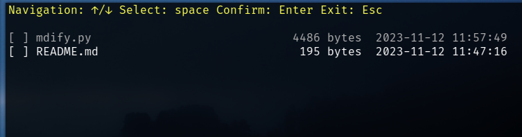

 # Mundane

We understand the occasional need to streamline repetitive tasks. That's the essence of this repository: practical scripts designed to simplify your daily development tasks.

|Script|Functionality|
|-|-|
|mdify.py \<target-dir>| Select multiple files to output it's sources into the Markdown codeblock format  |